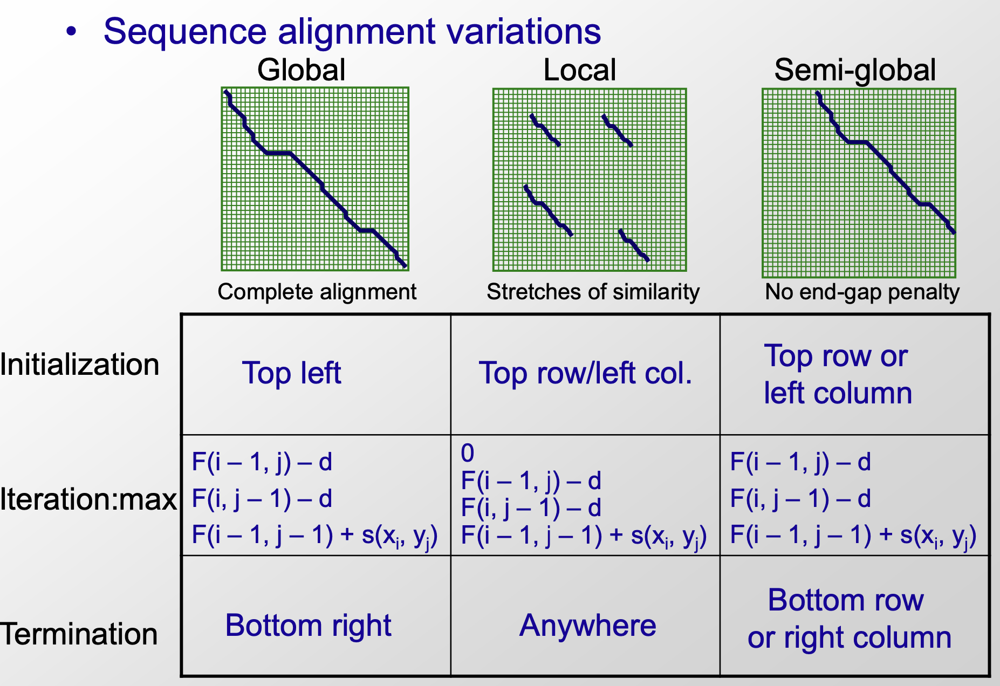

## Global alignment vs. Local alignment
### Needleman-Wunsch and Smith-Waterman

- Needleman-Wunsch 就是lecture02讲的比对算法（find the longest common sbusequence）
   - a type of global alignment
   - usually applied in homologous comparison 
   - less useful for rearrangements, inversion or aligning to reference sequences
- Comparison of global, local and semi-global alignment
   - global alignment: end-to-end alignment; local alignment: comparison of substrings from different long strings
   - application:
      - comparing conserved parts of a gene in small domains
      - searching-finding a small gene in a large chromosome
      - analyzing rearrangements in large segments
   - From computional perspects, global align that starting at (0,0) and ending at Bottom right, but local align that starting at any position and ending anywhere
   - semi-global initializing from top row/left column to bottom row/right column

**It's enssential is a type of global alignment that cannot get penalty when exist gaps in the initial or terminal position**

- Smith-Waterman作为local alignment 典型例子在needleman-wunsch的基础上，反复迭代每个位置作为起始位点记分至F=0止
   - 也可以通过在对角线周围限定范围降低时间和空间复杂度，但不一定能得到最优结果，实践效果却不错
- Varying gap penalty functions
   - Linear gap penalty: w(k)=k*p (每个gap罚相同的p分, 当前index是否有gap）
   - Quadratic: w(k)=p+q*rk^2 (考虑gap的长度，由于需要计算长度，增加了复杂度）
   - 加入binary value：starting a gap or not (添加第二个已经包含gap的矩阵）
   - Length （mod 3) gap penalty for protein-coding regions (考虑编码蛋白的密码子区域）
      - 将长度能被3整除的gaps赋予更少的得分（不会导致移码）
      - 要求更多的可能性声明
      - possible state：starting， mod 1=1,mod 2=2, mod 3=0
## Linear-time exact string matching

- Karp-Rabin algrithm and semi-numerical methods
   - interpret stings as numbers (fast comparison)
   - main:
      - compute next based on precious one
      - Hashing (mod p) to keep the numbers small
      - deal with spurious hits due to hashing collisions (处理变换之后重复的问题）
- Hash functions and randomized algorithms
   - 用mod p处理时间复杂度仍然高，减少数字范围优化
      - Hashing： 用hashing func mapping keys k in smaller space
      - Hashing func examples: x=y->h(x)=h(y) [reproducibility]; $x{\neq}y{\rightarrow}P(h(x)=h(y))=\frac{1}{m}$ [uniform output distrib] (输入字符不同，变换后相同的概率为1/m-均匀分布)
      - 存在一个新的问题：Collisions （不同的输入产生了相同的输出）
   - dealing with collisions , due to hashing
      - verify that a hit correspond to valid match (把所有比对上的序列都重新计算检查一遍）[耗时]
      - avoid worst-case behavior of many collisions (Choose random m) [合理] 
## The BLAST algorithm and inexact matching

- Sequence Database search
   - Given a query seq to find similar old seqs
   - query must be very fast for a new sequence
   - most sequence will be completely unrelated to query
- BLAST Overview
   - receive query
      - split query into overlapping words of length W [重要参数]
      - find neighborhood words for each word until threshold T [重要参数]
      - look in table where words occur: seeds S
      - extend seeds S until score drops off under X
   - report significance and alignment of each match
   - W choosing: 
      - Sequence length: n
      - Identities: t
      - W=[n/(n-t+1)]
   - Combs and Random projections
## Probabilistic foundations of sequence alignment

- Mismatch penalties, BLOSUM and PAM matrices
   - alignment score represent
      - likelihood ratio beteewn two hypotheses
         - H1: alignment due to chance (unrelated)
         - H2:alignment due to ancestry (related)
      - calcu probability
         - Pr(x,y\|U): P of alignment x,y by model U (unrelated)
         - Pr(x,y\|R): P of alignment x,y by model R (related)
      - Alignment score: likelihood ratio between the two
         - P that align not due to chance = P(x,y\|R)/P(x,y\|U)
         - Score=log(P)
   - Key idea of substitution Matrices: trust alignments of related seqences provide information about biologically permissible mutations
- Statistical significance of an alignment score
## Deterministic linear-time exact string matching

- Key insight: gather more info from each comparison
   - Special case （all same and all diff）
   - General case
      - learn internal redundancy structure of the pattern
      - Pattern pre-processing step
- Pre-processing, Z-algorithm, Boyer-More, KMP
   - 预处理序列，找出多次重复的pattern-Z-box
   - 如果z-box不在query seq, 直接比对，如果query seq上也有，基于P移动比对
